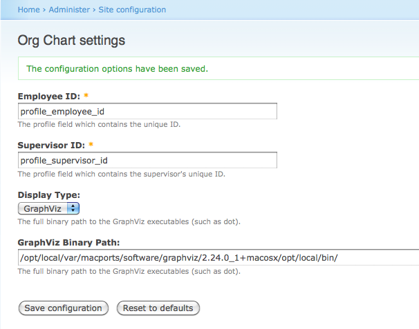
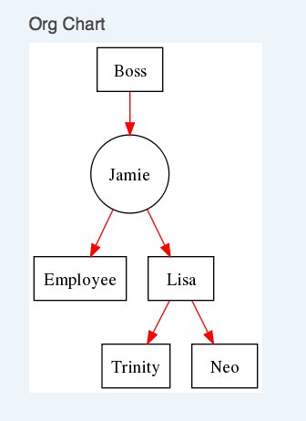

Intro
=====

An organizational chart that uses the profile.module. Install in your modules directory. Currently, it uses profile fields to build the chart. It assumes that there will be two fields that hold the following data:

* Employee ID - this can be any alphanumeric identifier
* Supervisor ID - this is the alphanumeric identifier pointing to the current user's supervisor.

In the administrator settings, you may specify the profile field names which correspond to these values. 

There are plans to have two other options for loading the data in the future:
1. A custom external table specific to the module
2. Some flat file

Installation
============

1. Copy orgchart source to your modules directory
2. make the orgchart/cache directory writeable
3. Enable via Administrative panel
4. Create profile fields to represent employee id (profile_employee_id) and supervisor id (profile_supervisor_id).
6. Make sure settings are okay
7. If you are using GraphViz display, you will need to install that on your system and provide the binary path
8. A Org Chart block will be displayed if you select it. Otherwise, the full org chart is displayed at /q?=orgchart

Roadmap
=======

* GraphViz 20100208
* GraphViz Cache
* Full company view

Media
=====

* 
* 
* 
